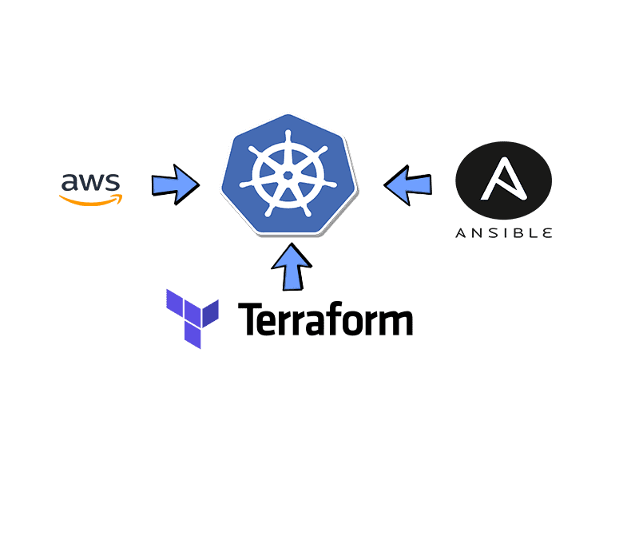

# Three-Tier Application on Kubernetes

This project is a three-tier web application consisting of a **React frontend**, a **Node.js backend**, and a **MySQL database**, deployed on a Kubernetes cluster using **Terraform** for infrastructure as code, **Ansible** for automation, and **GitLab CI/CD** for continuous integration and deployment. The application is designed to run in environments like **Killercoda** or **Play with Kubernetes (PWK)**.



## Project Structure
- **frontend/**: React application serving the user interface.
- **backend/**: Node.js API handling CRUD operations with MySQL.
- **database/**: MySQL database configuration.
- **kubernetes/**: Kubernetes YAML manifests for manual deployment.
- **terraform/**: Terraform configurations for infrastructure provisioning.
- **.gitlab-ci.yml**: GitLab CI/CD pipeline for building and pushing Docker images.
- **deploy.yml**: Ansible playbook for automating setup in Killercoda.

## Prerequisites
- **GitLab Account**: For repository and CI/CD pipeline.
- **Docker Hub Account**: For storing Docker images.
- **Killercoda** or **Play with Kubernetes**: For Kubernetes cluster.
- **Tools**:
  - Git
  - Docker
  - kubectl
  - Terraform (v1.5.7 or later)
  - Ansible (v2.9 or later)

## Setup Instructions

### 1. Clone the Repository
```bash
git clone https://gitlab.com/amin4m/three-tier-app.git
cd three-tier-app
```

### 2. Configure CI/CD
In GitLab, set up CI/CD Variables:
DOCKER_USERNAME: Your Docker Hub username (e.g., amin4m).

DOCKER_PASSWORD: Docker Hub access token.

BACKEND_IMAGE: amin4m/three-tier-backend.

FRONTEND_IMAGE: amin4m/three-tier-frontend.

DATABASE_IMAGE: amin4m/three-tier-database.

Push changes to the main branch to trigger the pipeline:
```bash
git add .
git commit -m "Initial commit"
git push origin main
```
Verify that Docker images (amin4m/three-tier-<component>:v1) are pushed to Docker Hub.

### 3. Deploy in Killercoda

Option 1: Using Ansible
Install Ansible:
```bash
apt update
apt install -y ansible
```
Create a GitLab Personal Access Token with api and read_repository scopes.

Export the token:
```bash
export GITLAB_TOKEN=<your-gitlab-token>
```
Run the Ansible playbook:
```bash
ansible-playbook deploy.yml
```
This automates:
Installing Terraform.

Cloning the repository.

Running terraform init and terraform apply.

Setting the default namespace to three-tier-app.

Waiting for pods to be Running.

Displaying the frontend URL.

Option 2: Manual Deployment with Terraform
Install Terraform:
```bash
wget https://releases.hashicorp.com/terraform/1.5.7/terraform_1.5.7_linux_amd64.zip
unzip terraform_1.5.7_linux_amd64.zip
mv terraform /usr/local/bin/
```
Navigate to the Terraform directory:
```bash
cd terraform
terraform init
terraform apply -auto-approve
```
Option 3: Manual Deployment with YAMLs
```bash
kubectl apply -f kubernetes/
```

### 4. Access the Application
Get the frontend NodePort:
```bash
kubectl get svc frontend-service
```
In Killercoda, enter the NodePort (e.g., 30611) in the "Add New Port" field.

Open the URL (e.g., https://<session-id>-30611.killercoda.com) in a browser.

Test the app by adding and viewing items

Troubleshooting
Backend CrashLoopBackOff:
Check logs: kubectl logs <backend-pod-name>.

Ensure backend/index.js uses host: (not host =) in the MySQL connection.

Verify the backend image (amin4m/three-tier-backend:v1) is updated in Docker Hub.

ENOTFOUND mysql_service:
Ensure mysql-service exists: kubectl get svc.

Test connectivity: kubectl exec -it <frontend-pod-name> -- ping mysql-service.

Pipeline Failure:
Check GitLab CI/CD logs for Docker login or build errors.

Verify DOCKER_USERNAME and DOCKER_PASSWORD in GitLab CI/CD Variables.

Pods Pending:
Check for taints: kubectl describe node | grep -i taint.

Remove taints if needed: kubectl taint nodes <node-name> node-role.kubernetes.io/control-plane:NoSchedule-.

Known Issues
Killercoda’s temporary environment may cache old images. Use imagePullPolicy: Always in deployments.

Play with Kubernetes requires kubeadm init and a CNI plugin (e.g., Weave Net)

```bash
kubectl apply -f https://github.com/weaveworks/weave/releases/download/v2.8.1/weave-daemonset-k8s.yaml
```

Future Improvements
Add monitoring with Prometheus and Grafana.

Implement auto-scaling for backend replicas.

Optimize CI/CD to build only changed components.

Use Helm charts for easier Kubernetes management.

Contact
For issues or contributions, contact [amin4m] via GitLab.

Built with  by amin4m
